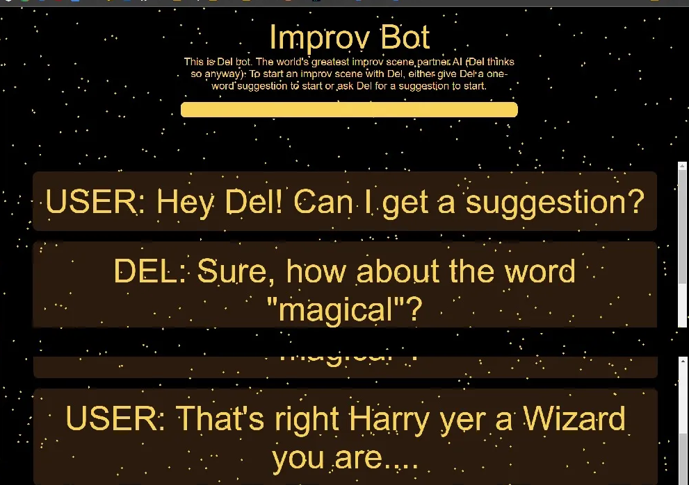

# Improv-Bot-OpenAI
Copy of my "first" programming project.
Original Improv Bot I created using an openAI completion model learned by interfacing with ChatGPT.

Snapshot of app.py running in local browser:

